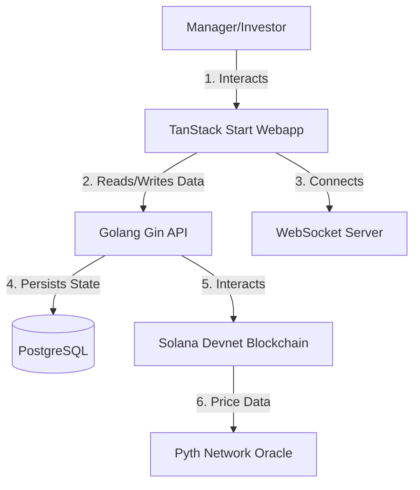

<a id="readme-top"></a> 

<!-- PROJECT LOGO -->
<br />
<div align="center">
  

  <h1 align="center">📈 Flux Platform</h1>

  <p align="center">
    <strong>Non-Custodial, Vault-Based Investment Platform on Solana!</strong>
    <br />
    A high-performance decentralized platform focusing on efficient data handling, robust state management, and advanced on-chain Oracle integrations.
    <br />
    <br />
    <a href="frontend"><strong>Explore the docs »</strong></a>
  </p>
</div>

<!-- TABLE OF CONTENTS -->
<details>
  <summary>Table of Contents</summary>
  <ol>
    <li>
      <a href="#what-is-flux">What is Flux?</a>
    </li>
    <li>
      <a href="#why-flux-key-advantages">Why Flux? (Key Advantages)</a>
    </li>
    <li>
      <a href="#key-platform-features">Key Platform Features</a>
    </li>
    <li>
      <a href="#system-architecture">System Architecture</a>
    </li>
    <li>
      <a href="#repository-structure">Repository Structure</a>
    </li>
    <li>
      <a href="#tech-stack">Tech Stack</a>
    </li>
    <li>
      <a href="#getting-started">Getting Started</a>
    </li>
  </ol>
</details>

## What is Flux?

**Flux** is a non-custodial, vault-based investment platform built on the **Solana blockchain**. It solves UX and performance limitations observed in existing market solutions by providing a seamless, high-performance environment for both fund managers and investors.

Through Flux, managers can create vaults, set fee structures, and execute trades using on-chain **Pyth Network Oracle** data to ensure mathematically pure executions. Investors can deposit SOL or USDC into vaults, receive state-based "Share Tokens," and monitor real-time PnL with lightning-fast WebSocket updates.

<p align="right">(<a href="#readme-top">back to top</a>)</p>

## Why Flux? (Key Advantages)

* **⚡ Real-Time PnL & WebSocket Updates:** Replaces slow HTTP polling with real-time WebSocket subscriptions pushing updates instantly to the client.
* **🛡️ Non-Custodial Vaults:** Built entirely on Solana using the Anchor framework. Vaults are PDAs (Program Derived Addresses) ensuring funds are secure and completely decentralized.
* **💹 On-Chain Pyth Oracle Integration:** Swap execution relies on live Devnet prices directly from the Pyth Network Price Accounts, ensuring transparent and accurate token conversions.
* **🎯 High-Performance React UI:** Leverages TanStack Start, Zustand for strict quote-locking state, and `@tanstack/react-virtual` for DOM windowing to prevent UI lag on massive vault lists.
* **🔥 State Conflict Resolution:** True isolation between Manager and Investor modes utilizing independent session storage, guaranteeing an intuitive and bug-free user experience.

<p align="right">(<a href="#readme-top">back to top</a>)</p>

## Key Platform Features

* **Manager Dashboard:** 
  * Vault creation with highly customizable parameters (`minRaiseAmount`, `performanceFee`, `managementFee`, `lockupPeriod`).
  * Advanced management to edit vault metadata (Tags, Focus Assets) synced seamlessly with the Postgres backend.
  * Trade execution directly with the Pyth Oracle AMM, complete with automated fee distribution.
* **Investor Workspace:**
  * Effortless SOL/USDC deposit flows to receive programmatic Share Tokens.
  * Instant in-kind withdrawal capability claiming underlying assets directly from the vault.
  * Live portfolio tracking and real-time dashboard PnL monitoring.
* **System & UX Enhancements:**
  * Centralized dust filtering threshold shared between API and frontend.
  * Advanced pending transaction state store with Solscan block explorer links.
  * Auto-invalidation and cache refetching on successful WebSocket swap confirmations.

<p align="right">(<a href="#readme-top">back to top</a>)</p>

## System Architecture



<p align="right">(<a href="#readme-top">back to top</a>)</p>

## Repository Structure

```text
.
├── backend/                # Go (Gin) backend API server & database services
│   ├── cmd/                # Entrypoints (server, seed)
│   ├── internal/           # Handlers, repositories, domain models, WebSocket
│   └── pkg/                # Solana client & shared utilities
├── frontend/               # React + TanStack Start frontend application
│   ├── src/                # Components, routes, hooks, services, stores
│   └── public/             # Static assets and branding
└── contracts/              # Solana Anchor smart contract program
```

<p align="right">(<a href="#readme-top">back to top</a>)</p>

## Tech Stack

* **Frontend:** React, TanStack Start, TanStack Query, Zustand, TailwindCSS, Lucide Icons
* **Backend:** Go (Gin), PostgreSQL (GORM), Redis, WebSockets
* **Smart Contracts:** Solana, Rust, Anchor Framework, Pyth Hermes Oracle

<p align="right">(<a href="#readme-top">back to top</a>)</p>

## Getting Started

Follow these instructions to run the Flux platform on your local machine.

### Prerequisites

* Node.js (v18+)
* Go (v1.22+)
* Docker & Docker Compose

### Quick Start

1. **Clone Repository:**
   ```bash
   git clone https://github.com/your-org/flux.git
   cd flux
   ```

2. **Start Backend Services:**
   ```bash
   cd backend
   docker-compose up -d
   go run cmd/server/main.go
   ```

3. **Start Frontend Dev Server:**
   ```bash
   cd ../frontend
   npm install
   npm run dev
   ```

<p align="right">(<a href="#readme-top">back to top</a>)</p>
