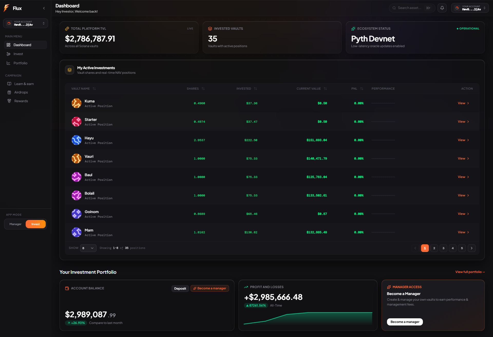
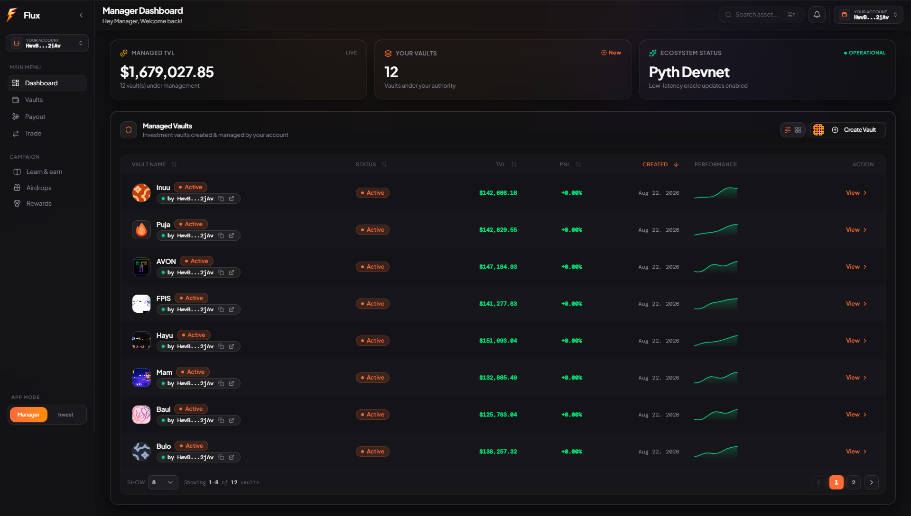
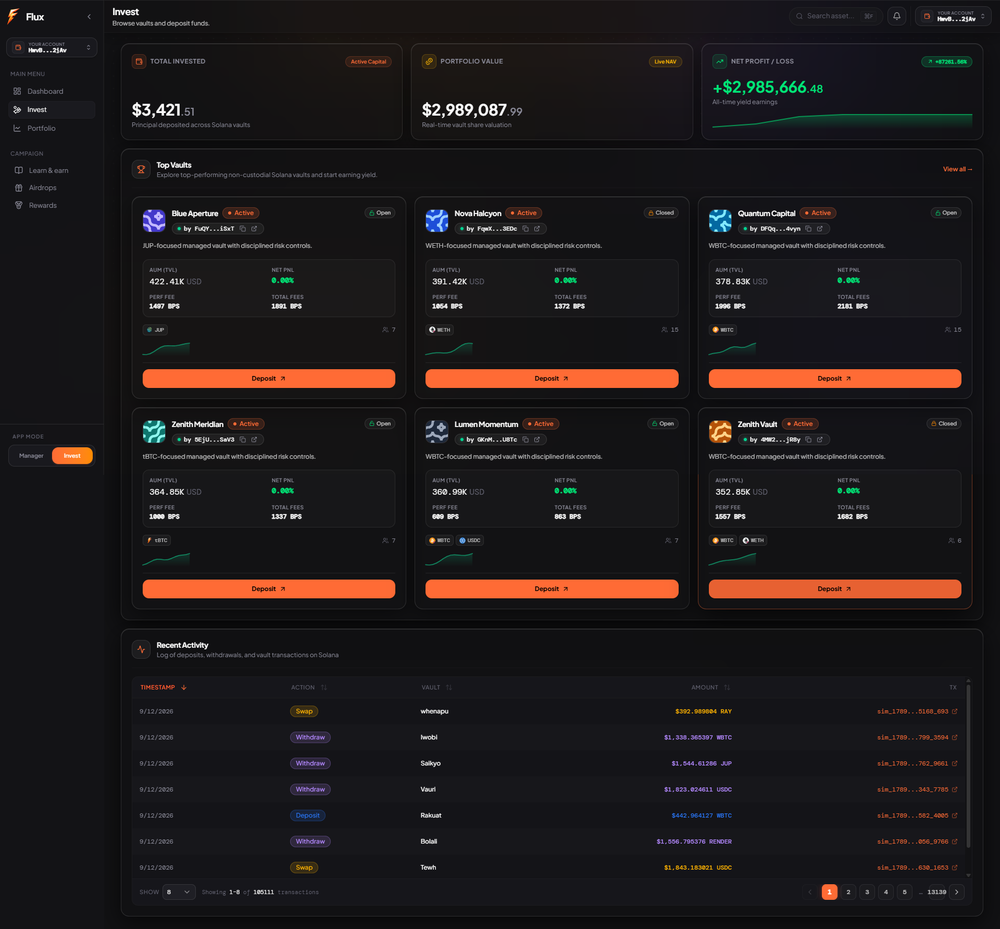
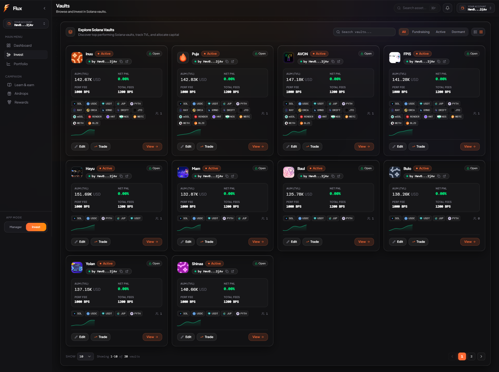
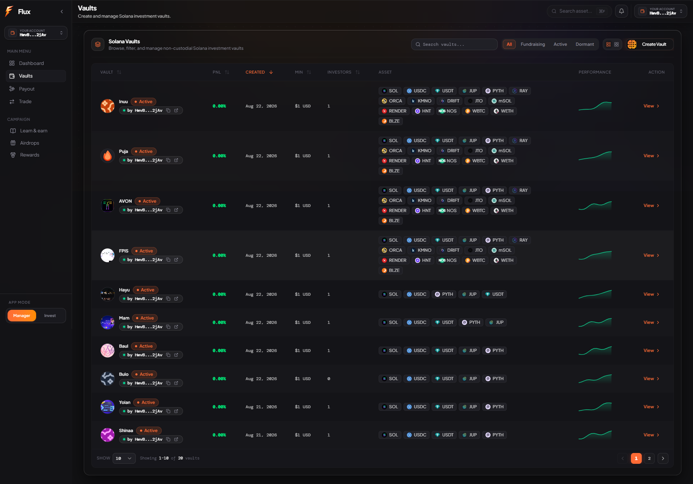
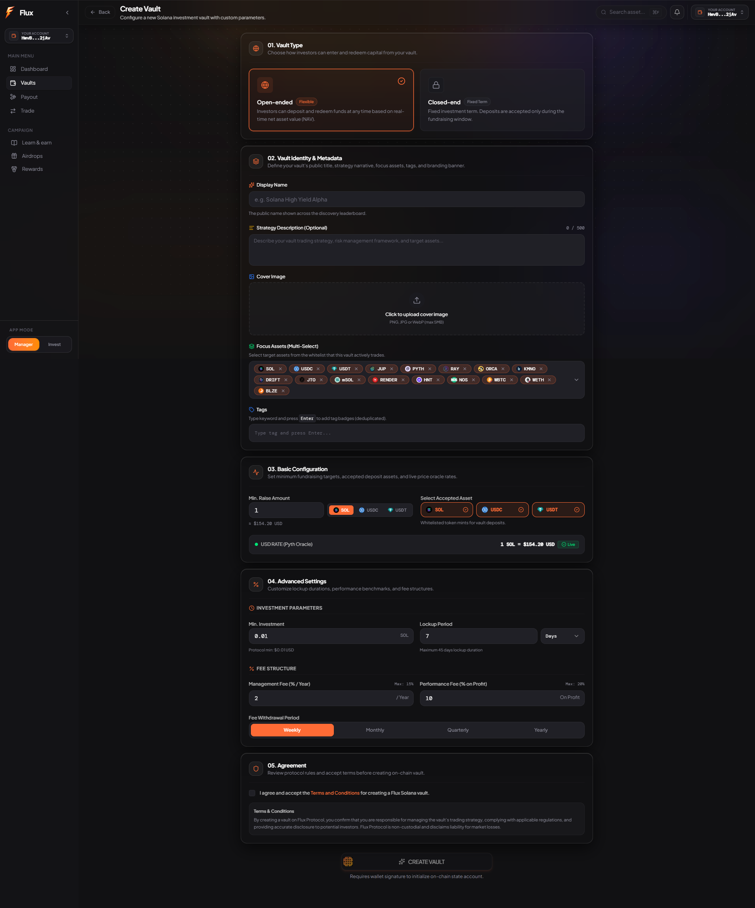
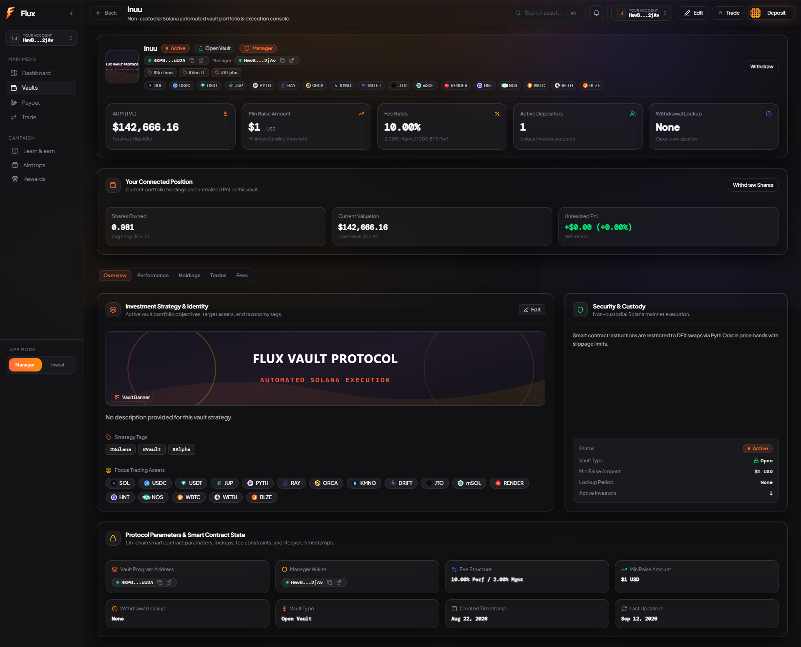
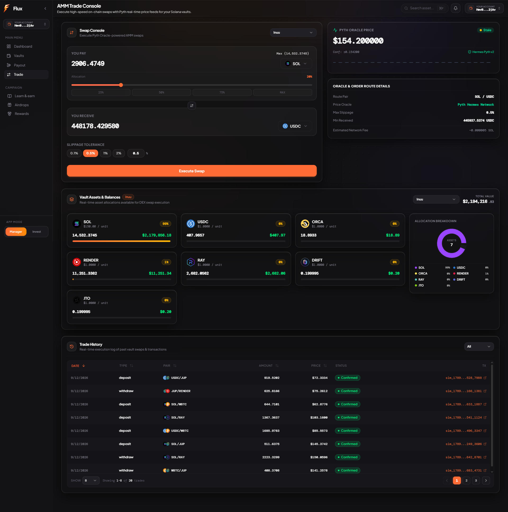
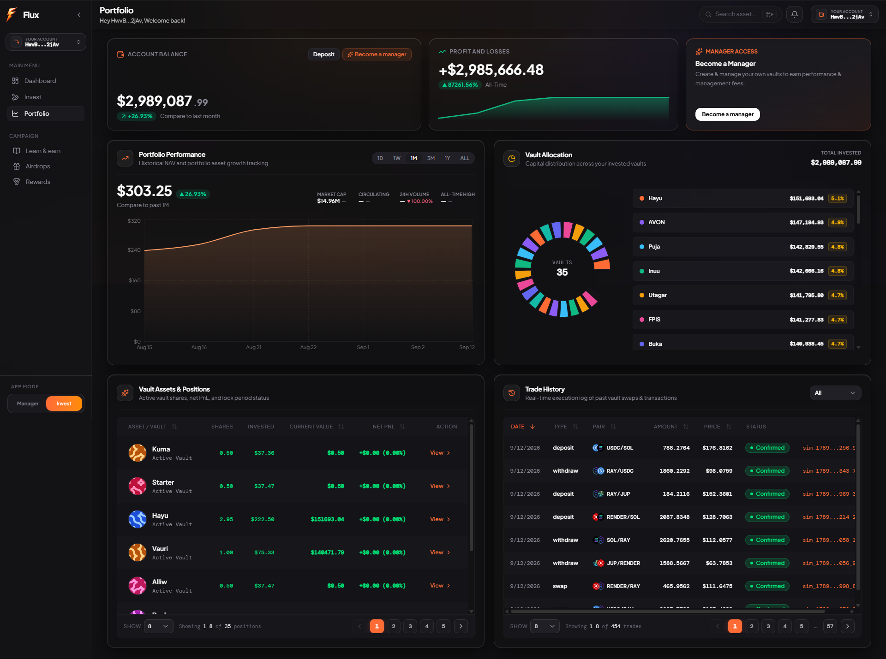
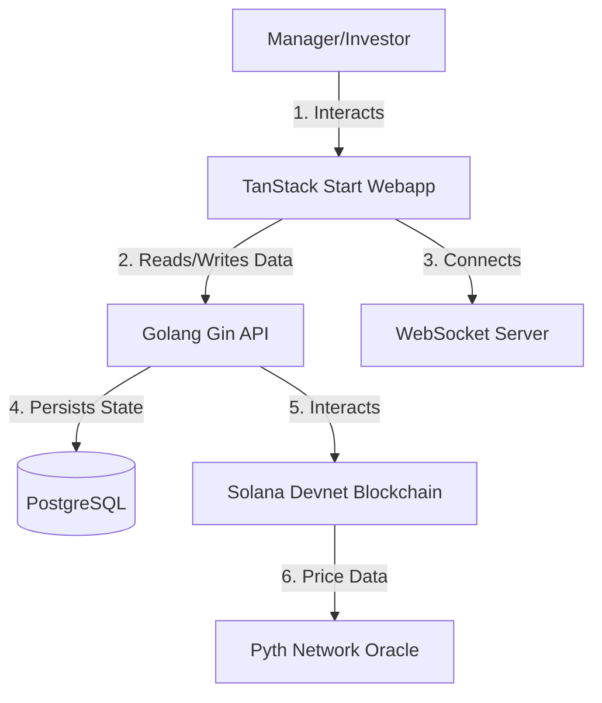

<a id="readme-top"></a> 

<!-- PROJECT LOGO -->
<br />
<div align="center">
  

  <h1 align="center">📈 Flux Platform</h1>

  <p align="center">
    <strong>Non-Custodial, Vault-Based Investment Platform on Solana!</strong>
    <br />
    A high-performance decentralized platform focusing on efficient data handling, robust state management, and advanced on-chain Oracle integrations.
    <br />
    <br />
    <a href="frontend"><strong>Explore the docs »</strong></a>
  </p>
</div>

<!-- TABLE OF CONTENTS -->
<details>
  <summary>Table of Contents</summary>
  <ol>
    <li>
      <a href="#what-is-flux">What is Flux?</a>
    </li>
    <li>
      <a href="#why-flux-key-advantages">Why Flux? (Key Advantages)</a>
    </li>
    <li>
      <a href="#application-showcase">Application Showcase</a>
    </li>
    <li>
      <a href="#key-platform-features">Key Platform Features</a>
    </li>
    <li>
      <a href="#system-architecture">System Architecture</a>
    </li>
    <li>
      <a href="#repository-structure">Repository Structure</a>
    </li>
    <li>
      <a href="#tech-stack">Tech Stack</a>
    </li>
    <li>
      <a href="#getting-started">Getting Started</a>
    </li>
  </ol>
</details>

## What is Flux?

**Flux** is a non-custodial, vault-based investment platform built on the **Solana blockchain**. It solves UX and performance limitations observed in existing market solutions by providing a seamless, high-performance environment for both fund managers and investors.

Through Flux, managers can create vaults, set fee structures, and execute trades using on-chain **Pyth Network Oracle** data to ensure mathematically pure executions. Investors can deposit SOL or USDC into vaults, receive state-based "Share Tokens," and monitor real-time PnL with lightning-fast WebSocket updates.

<p align="right">(<a href="#readme-top">back to top</a>)</p>

## Why Flux? (Key Advantages)

* **⚡ Real-Time PnL & WebSocket Updates:** Replaces slow HTTP polling with real-time WebSocket subscriptions pushing updates instantly to the client.
* **🛡️ Non-Custodial Vaults:** Built entirely on Solana using the Anchor framework. Vaults are PDAs (Program Derived Addresses) ensuring funds are secure and completely decentralized.
* **💹 On-Chain Pyth Oracle Integration:** Swap execution relies on live Devnet prices directly from the Pyth Network Price Accounts, ensuring transparent and accurate token conversions.
* **🎯 High-Performance React UI:** Leverages TanStack Start, Zustand for strict quote-locking state, and `@tanstack/react-virtual` for DOM windowing to prevent UI lag on massive vault lists.
* **🔥 State Conflict Resolution:** True isolation between Manager and Investor modes utilizing independent session storage, guaranteeing an intuitive and bug-free user experience.

<p align="right">(<a href="#readme-top">back to top</a>)</p>

## Application Showcase

Explore the core user journeys and interfaces of Flux across Investor, Manager, Trading, and Vault workflows.

---

### 1. Investor Dashboard (`/`)
> Real-time overview of the investor's total deposited capital, overall PnL, live directional sparklines, and active invested vault positions.
<br />
<p align="center">
  
</p>

---

### 2. Manager Dashboard (`/` in Manager Mode)
> Dedicated control center for fund managers displaying total managed TVL, active managed vaults with table/grid switcher, performance metrics, and quick access to trade consoles.
<br />
<p align="center">
  
</p>

---

### 3. Invest Hub (`/invest`)
> Investor discovery portal showcasing aggregate investment stats, top featured high-yield vaults, curated performance cards, and live on-chain deposit/withdrawal activity.
<br />
<p align="center">
  
</p>

---

### 4. Browse Vaults (`/invest/vaults`)
> Investor-focused vault directory tailored for capital allocators, featuring card/grid visualizations, tag filters, asset focus chips, and instant deposit shortcuts.
<br />
<p align="center">
  
</p>

---

### 5. Vaults Directory (`/vaults`)
> Comprehensive directory of all active, fundraising, and closed vaults with dynamic search, multi-metric sorting (TVL, 30D Return, Investors), tags, and organic directional sparklines.
<br />
<p align="center">
  
</p>

---

### 6. Create Vault Modal (`/vaults/create`)
> Intuitive modal wizard allowing managers to deploy new on-chain Solana vaults by configuring parameters such as target raise, management fees, performance fees, and lockup duration.
<br />
<p align="center">
  
</p>

---

### 7. Vault Detail (`/vaults/:id` & `/invest/vaults/:id`)
> In-depth breakdown of a single vault featuring historical NAV performance charts, asset holdings breakdown, trade logs, fee collection, and the deposit/withdraw interaction card.
<br />
<p align="center">
  
</p>

---

### 8. Pyth AMM Trade Console (`/trade`)
> High-precision AMM execution interface for vault managers, backed by live Pyth Network Hermes price oracles, confidence bands, execution rates, and atomic in-memory balance updates.
<br />
<p align="center">
  
</p>

---

### 9. Portfolio & History (`/portfolio`)
> Complete investor analytics hub with historical PnL curves, interactive timeframe selectors (1D, 1W, 1M, 3M, 1Y, ALL), asset allocation donut charts, and live trade history.
<br />
<p align="center">
  
</p>

---

<p align="right">(<a href="#readme-top">back to top</a>)</p>

## Key Platform Features

* **Manager Dashboard:** 
  * Vault creation with highly customizable parameters (`minRaiseAmount`, `performanceFee`, `managementFee`, `lockupPeriod`).
  * Advanced management to edit vault metadata (Tags, Focus Assets) synced seamlessly with the Postgres backend.
  * Interactive AMM Trade console with Pyth Hermes multi-pair pricing, confidence bands, execution rates, and direct swap execution.
  * Live Manager TVL calculations and segmented table/grid layout switches.
* **Investor Workspace:**
  * Effortless SOL/USDC deposit flows to receive programmatic Share Tokens.
  * Instant in-kind withdrawal capability claiming underlying assets directly from the vault.
  * Real-time portfolio tracking, invested vault allocation charts, and live trade history.
* **System & UX Enhancements:**
  * Directional organic sparkline generator with endpoint damping ensuring realistic PnL curves per vault.
  * Centralized dust filtering threshold shared between API and frontend.
  * Advanced pending transaction state store with Solscan block explorer links.
  * Zero-HTTP in-memory query cache mutations on real-time WebSocket swap and trade events.

<p align="right">(<a href="#readme-top">back to top</a>)</p>

## System Architecture



<p align="right">(<a href="#readme-top">back to top</a>)</p>

## Repository Structure

```text
.
├── backend/                # Go (Gin) backend API server & database services
│   ├── cmd/                # Entrypoints (server, seed)
│   ├── internal/           # Handlers, repositories, domain models, WebSocket
│   └── pkg/                # Solana client & shared utilities
├── frontend/               # React + TanStack Start frontend application
│   ├── src/                # Components, routes, hooks, services, stores
│   └── public/             # Static assets and branding
└── contracts/              # Solana Anchor smart contract program
```

<p align="right">(<a href="#readme-top">back to top</a>)</p>

## Real-Time WebSocket Architecture & Performance Optimizations ⚡

Flux delivers institutional-grade real-time market data streaming and state synchronization designed to eliminate network overhead, UI thrashing, and database bottlenecks.

### 1. Zero-HTTP WebSocket Ingestion
* **No Cache Invalidation Storms:** Rather than executing destructive `queryClient.invalidateQueries` calls upon every tick (which triggers heavy cascade HTTP polling), incoming WebSocket events mutate React Query in-memory caches directly.
* **Modular Single-Responsibility Handlers:** Event processing is split into dedicated, isolated handlers (`vaultHandler.ts`, `portfolioSummaryHandler.ts`, `activityHandler.ts`) adhering to the Single Responsibility Principle.

### 2. 200ms Micro-Interval Batch Processing
* **Frame-Rate Protection:** High-frequency event streams (e.g. 50-100 ticks/sec from high-throughput simulation) are buffered in memory and flushed in atomic 200ms batches (~5 FPS batch updates with smooth 60 FPS rendering) via `useBatchedWebSocket`.
* **Zero Component Re-render Thrashing:** Multiple trades, TVL shifts, and portfolio delta updates in the same interval are merged before dispatching a single atomic React Query cache update.

### 3. Dynamic Viewport-Scoped Subscriptions
* **Client-Driven Selective Routing:** Through `useVisibleVaultsWs` and `useRouteWsChannel`, clients only subscribe to channels for items currently in view (`vault:<id>`, `portfolio:<wallet>`, `user:<wallet>`).
* **Clean Channel Diffing:** Navigating between views automatically subscribes to newly visible resources and unsubscribes from off-screen resources without tearing down persistent socket connections.

### 4. Database Pre-Aggregation with PostgreSQL Materialized Views
* **O(1) Portfolio Aggregation:** Database endpoints query the `user_pnl_summary` materialized view directly. The 3 summary metrics (`TOTAL INVESTED`, `PORTFOLIO VALUE`, `NET PROFIT / LOSS`) return pre-computed aggregates in a single row without scanning or iterating over individual position records.
* **Authenticated Session Scope:** Private endpoints (`/api/v1/portfolio/summary`, `/api/v1/portfolio/history`, `/api/v1/transactions`) resolve the user's wallet automatically from session authentication tokens, preventing URL tampering and data scraping.

<p align="right">(<a href="#readme-top">back to top</a>)</p>

## Market Simulation Engine 🚀

Flux includes a standalone high-frequency market simulator designed to test high-load scenarios, multi-vault price fluctuations, simulated swaps, and investor portfolio updates.

### Running the Simulator

1. **Start the Simulator against a running backend:**
   ```bash
   cd backend
   go run ./cmd/simulator --interval=150 --wallet=<YOUR_CONNECTED_WALLET>
   ```

2. **Available Simulator Options:**
   | Flag | Default | Description |
   | --- | --- | --- |
   | `--interval` | `100` | Tick interval in milliseconds (e.g. `50`, `100`, `250`) |
   | `--wallet` | `""` | Target user wallet to simulate live deposits, swaps, and PnL updates |
   | `--vault` | `""` | Target specific vault ID (if empty, simulates top 10 vaults in DB) |
   | `--ws` | `ws://localhost:8080/api/v1/ws` | WebSocket endpoint URL |
   | `--burst` | `false` | Enable random spike volume and market volatility |
   | `--mode` | `stream` | `stream` (feeder mode) or `client-listener` (benchmark mode) |

<p align="right">(<a href="#readme-top">back to top</a>)</p>

## Tech Stack

* **Frontend:** React, TanStack Start, TanStack Query, Zustand, TailwindCSS, Lucide Icons
* **Backend:** Go (Gin), PostgreSQL (GORM), TimescaleDB, PgBouncer, Redis, Gorilla WebSocket
* **Smart Contracts:** Solana, Rust, Anchor Framework, Pyth Hermes Oracle

<p align="right">(<a href="#readme-top">back to top</a>)</p>

## Getting Started

Follow these instructions to run the Flux platform on your local machine.

### Prerequisites

* Node.js (v18+)
* Go (v1.22+)
* Docker & Docker Compose

### Quick Start

1. **Clone Repository:**
   ```bash
   git clone https://github.com/Fnz11/flux.git
   cd flux
   ```

2. **Start Backend Infrastructure & Server:**
   ```bash
   cd backend
   docker compose up -d
   ```

3. **Start Frontend Dev Server:**
   ```bash
   cd ../frontend
   pnpm install
   pnpm run dev
   ```

4. **Launch the High-Frequency Simulator:**
   ```bash
   cd ../backend
   go run ./cmd/simulator --interval=150 --wallet=<CONNECTED_WALLET>
   ```

<p align="right">(<a href="#readme-top">back to top</a>)</p>
