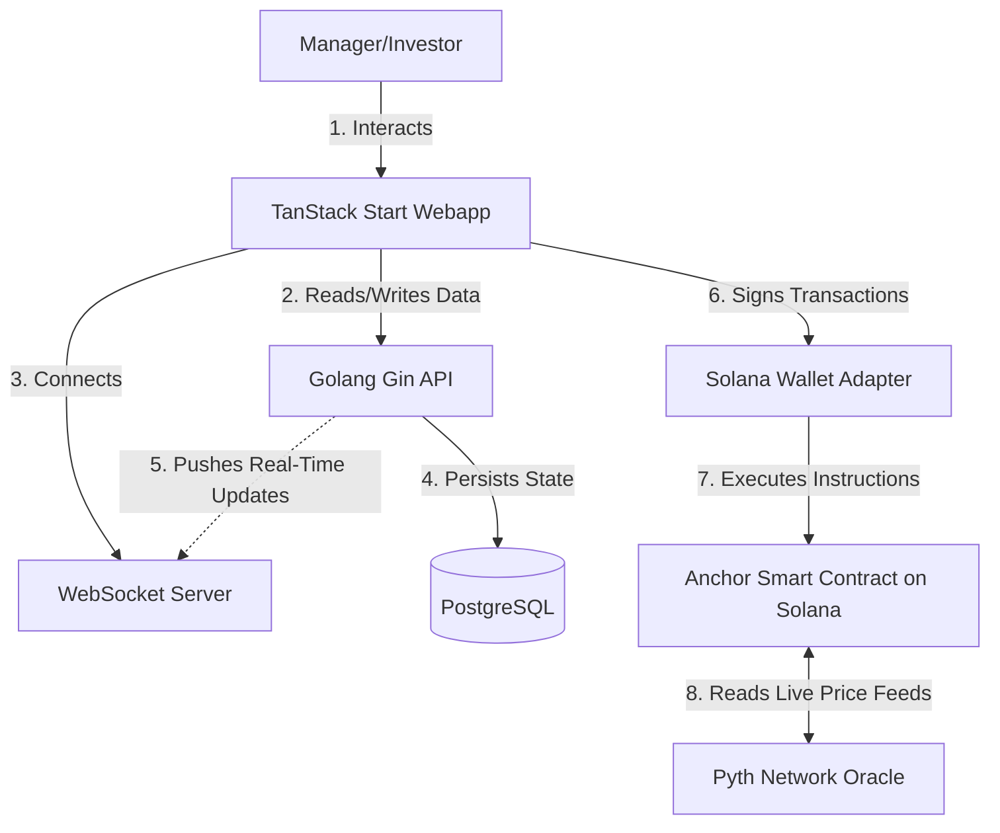

<a id="readme-top"></a> 

<!-- PROJECT SHIELDS -->
[![Forks][forks-shield]][forks-url]
[![Stargazers][stars-shield]][stars-url]
[![Issues][issues-shield]][issues-url]
[![MIT License][license-shield]][license-url]
[![LinkedIn][linkedin-shield]][linkedin-url]

<!-- PROJECT LOGO -->
<br />
<div align="center">
  

  <h1 align="center">📈 FBYT Platform</h1>

  <p align="center">
    <strong>Non-Custodial, Vault-Based Investment Platform on Solana!</strong>
    <br />
    A high-performance decentralized platform focusing on efficient data handling, robust state management, and advanced on-chain Oracle integrations.
    <br />
    <br />
    <a href="frontend"><strong>Explore the docs »</strong></a>
    <br />
    <br />
    <a href="https://github.com/Fnz11/fbyt-clone-1/issues/new?labels=bug&template=bug-report.md">Report Bug</a>
    ·
    <a href="https://github.com/Fnz11/fbyt-clone-1/issues/new?labels=enhancement&template=feature-request.md">Request Feature</a>
  </p>
</div>

<!-- TABLE OF CONTENTS -->
<details>
  <summary>Table of Contents</summary>
  <ol>
    <li>
      <a href="#what-is-fbyt">What is FBYT?</a>
    </li>
    <li>
      <a href="#why-fbyt-key-advantages">Why FBYT? (Key Advantages)</a>
    </li>
    <li>
      <a href="#key-platform-features">Key Platform Features</a>
    </li>
    <li>
      <a href="#system-architecture">System Architecture</a>
    </li>
    <li>
      <a href="#project-folder-structure">Project Folder Structure</a>
    </li>
    <li>
      <a href="#built-with-technologies">Built With (Technologies)</a>
    </li>
    <li>
      <a href="#getting-started-quick-start">Getting Started (Quick Start)</a>
      <ul>
        <li><a href="#prerequisites">Prerequisites</a></li>
        <li><a href="#installation--setup">Installation & Setup</a></li>
      </ul>
    </li>
    <li><a href="#license">License</a></li>
    <li><a href="#contact">Contact</a></li>
  </ol>
</details>

---

## What is FBYT?

**FBYT** is a non-custodial, vault-based investment platform built on the **Solana blockchain**. It solves UX and performance limitations observed in existing market solutions by providing a seamless, high-performance environment for both fund managers and investors.

Through FBYT, managers can create vaults, set fee structures, and execute trades using on-chain **Pyth Network Oracle** data to ensure mathematically pure executions. Investors can deposit SOL or USDC into vaults, receive state-based "Share Tokens," and monitor real-time PnL with lightning-fast WebSocket updates.

<p align="right">(<a href="#readme-top">back to top</a>)</p>

## Why FBYT? (Key Advantages)

* **⚡ Real-Time PnL & WebSocket Updates:** Replaces slow HTTP polling with real-time WebSocket subscriptions pushing updates instantly to the client.
* **🛡️ Non-Custodial Vaults:** Built entirely on Solana using the Anchor framework. Vaults are PDAs (Program Derived Addresses) ensuring funds are secure and completely decentralized.
* **💹 On-Chain Pyth Oracle Integration:** Swap execution relies on live Devnet prices directly from the Pyth Network Price Accounts, ensuring transparent and accurate token conversions.
* **🎯 High-Performance React UI:** Leverages TanStack Start, Zustand for strict quote-locking state, and `@tanstack/react-virtual` for DOM windowing to prevent UI lag on massive vault lists.
* **🔥 State Conflict Resolution:** True isolation between Manager and Investor modes utilizing independent session storage, guaranteeing an intuitive and bug-free user experience.

<p align="right">(<a href="#readme-top">back to top</a>)</p>

## Key Platform Features

* **Manager Dashboard:** 
  * Vault creation with highly customizable parameters (`minRaiseAmount`, `performanceFee`, `managementFee`, `lockupPeriod`).
  * Advanced management to edit vault metadata (Tags, Focus Assets) synced seamlessly with the Postgres backend.
  * Trade execution directly with the Pyth Oracle AMM, complete with automated fee distribution.
* **Investor Workspace:**
  * Effortless SOL/USDC deposit flows to receive programmatic Share Tokens.
  * Instant in-kind withdrawal capability claiming underlying assets directly from the vault.
  * Live portfolio tracking and real-time dashboard PnL monitoring.
* **System & UX Enhancements:**
  * Centralized dust filtering threshold shared between API and frontend.
  * Advanced pending transaction state store with Solscan block explorer links.
  * Auto-invalidation and cache refetching on successful WebSocket swap confirmations.

<p align="right">(<a href="#readme-top">back to top</a>)</p>

## System Architecture



<p align="right">(<a href="#readme-top">back to top</a>)</p>

## Project Folder Structure

```
fbyt-clone-1/
├── contracts/               # Solana Smart Contracts (Anchor Framework)
│   ├── programs/            # Main vault logic, deposits, withdrawals, Pyth AMM trades
│   └── tests/               # Comprehensive contract unit tests
├── backend/                 # Go (Golang) API Backend Service
│   ├── models/              # Gorm models (Vault, TradeHistory)
│   ├── routes/              # Gin REST API routers
│   └── websockets/          # Gorilla WebSockets implementation
├── frontend/                # TanStack Start Web App (TypeScript + React)
│   ├── app/                 # App Router pages (Manage, Invest, General)
│   ├── components/          # Tailwind/Shadcn UI components
│   └── store/               # Zustand global state management
└── docker-compose.yml       # Infrastructure orchestration
```

<p align="right">(<a href="#readme-top">back to top</a>)</p>

## Built With (Technologies)

* **Core & Logic:**
  * [![TanStack Start][TanStack-shield]][TanStack-url] (TanStack Start)
  * [![React][React-shield]][React-url] (React v19)
  * [![Go][Go-shield]][Go-url] (Go v1.21+)
  * [![TypeScript][TS-shield]][TS-url] (TypeScript)
* **CSS Styling:**
  * [![Tailwind][Tailwind-shield]][Tailwind-url] (Tailwind CSS)
* **Database & Real-time:**
  * [![PostgreSQL][Postgres-shield]][Postgres-url] (PostgreSQL)
  * [![WebSocket][WebSocket-shield]][WebSocket-url] (Gorilla WebSocket)
* **Blockchain Core:**
  * [![Solana][Solana-shield]][Solana-url] (Solana)
  * [![Anchor][Anchor-shield]][Anchor-url] (Anchor Framework)
* **Oracles:**
  * [![Pyth][Pyth-shield]][Pyth-url] (Pyth Network Oracle)

<p align="right">(<a href="#readme-top">back to top</a>)</p>

## Getting Started (Quick Start)

Follow these instructions to run the FBYT platform on your local machine.

### Prerequisites

Ensure you have the following installed:
* **Docker & Docker Compose**
* **Node.js** (v18 or higher)
* **Go** (v1.21 or higher)
* **Solana CLI** & **Anchor CLI**

### Installation & Setup

1. **Clone the Repository**
   ```sh
   git clone https://github.com/Fnz11/fbyt-clone-1.git
   cd fbyt-clone-1
   ```

2. **Run Infrastructure Containers**
   Spin up PostgreSQL instance in the background:
   ```sh
   docker-compose up -d
   ```

3. **Deploy Smart Contracts (Folder `contracts/`)**
   ```sh
   cd contracts
   yarn install
   anchor build
   # Ensure your Solana CLI is configured for devnet or localnet
   anchor deploy
   cd ..
   ```

4. **Run the Go API Backend (Folder `backend/`)**
   Configure your database connections and program IDs:
   ```sh
   cd backend
   go mod tidy
   go run main.go
   cd ..
   ```

5. **Start the TanStack Start Frontend (Folder `frontend/`)**
   ```sh
   cd frontend
   npm install
   npm run dev
   ```

<p align="right">(<a href="#readme-top">back to top</a>)</p>

## License

Distributed under the MIT License. See `LICENSE.md` for more information.

<p align="right">(<a href="#readme-top">back to top</a>)</p>

## Contact

Fikri Nurdiansyah

[![gmail][gmail-shield]][gmail-url]
[![telegram][telegram-shield]][telegram-url]
[![linkedin][linkedin-shield]][linkedin-url]

Project Link: [https://github.com/Fnz11/fbyt-clone-1](https://github.com/Fnz11/fbyt-clone-1)

<p align="right">(<a href="#readme-top">back to top</a>)</p>

<!-- MARKDOWN LINKS & IMAGES -->
[forks-shield]: https://img.shields.io/github/forks/Fnz11/fbyt-clone-1.svg?style=for-the-badge
[forks-url]: https://github.com/Fnz11/fbyt-clone-1/network/members
[stars-shield]: https://img.shields.io/github/stars/Fnz11/fbyt-clone-1.svg?style=for-the-badge
[stars-url]: https://github.com/Fnz11/fbyt-clone-1/stargazers
[issues-shield]: https://img.shields.io/github/issues/Fnz11/fbyt-clone-1.svg?style=for-the-badge
[issues-url]: https://github.com/Fnz11/fbyt-clone-1/issues
[license-shield]: https://img.shields.io/github/license/Fnz11/fbyt-clone-1.svg?style=for-the-badge
[license-url]: https://github.com/Fnz11/fbyt-clone-1/blob/master/LICENSE.md
[linkedin-shield]: https://img.shields.io/badge/-LinkedIn-black.svg?style=for-the-badge&logo=linkedin&colorB=555
[linkedin-url]: https://www.linkedin.com/in/fikri-nurdiansyah-214387286/
[telegram-shield]: https://img.shields.io/badge/Telegram-2CA5E0?style=for-the-badge&logo=telegram&logoColor=white
[telegram-url]: https://t.me/ysfik
[gmail-shield]: https://img.shields.io/badge/Gmail-D14836?style=for-the-badge&logo=gmail&logoColor=white
[gmail-url]: mailto:finz1112@gmail.com

[TanStack-shield]: https://img.shields.io/badge/TanStack-FF4154?style=for-the-badge&logo=reactquery&logoColor=white
[TanStack-url]: https://tanstack.com/
[React-shield]: https://img.shields.io/badge/React-20232A?style=for-the-badge&logo=react&logoColor=61DAFB
[React-url]: https://reactjs.org/
[Tailwind-shield]: https://img.shields.io/badge/tailwindcss-0F172A?style=for-the-badge&logo=tailwindcss
[Tailwind-url]: https://tailwindcss.com/
[Go-shield]: https://img.shields.io/badge/Go-00ADD8?style=for-the-badge&logo=go&logoColor=white
[Go-url]: https://go.dev/
[TS-shield]: https://img.shields.io/badge/TypeScript-3178C6?style=for-the-badge&logo=typescript&logoColor=white
[TS-url]: https://www.typescriptlang.org/
[Postgres-shield]: https://img.shields.io/badge/PostgreSQL-4169E1?style=for-the-badge&logo=postgresql&logoColor=white
[Postgres-url]: https://www.postgresql.org/
[Solana-shield]: https://img.shields.io/badge/Solana-14F195?style=for-the-badge&logo=solana&logoColor=white
[Solana-url]: https://solana.com/
[Anchor-shield]: https://img.shields.io/badge/Anchor-000000?style=for-the-badge&logo=anchor&logoColor=white
[Anchor-url]: https://www.anchor-lang.com/
[Pyth-shield]: https://img.shields.io/badge/Pyth-A9A5FF?style=for-the-badge&logo=pyth&logoColor=white
[Pyth-url]: https://pyth.network/
[WebSocket-shield]: https://img.shields.io/badge/WebSocket-010101?style=for-the-badge&logo=socket.io&logoColor=white
[WebSocket-url]: https://github.com/gorilla/websocket
