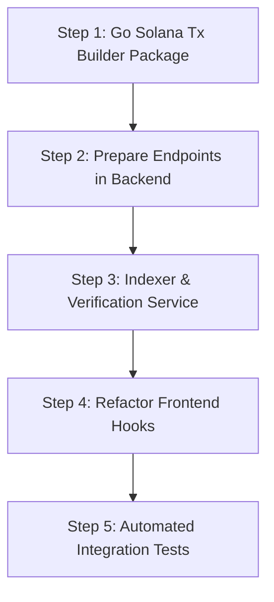

# Enterprise Transaction Architecture Plan (Non-Trade Operations)

## 1. Executive Summary & Strategy

This document outlines the architectural transformation of transaction lifecycles for all **non-trade** operations (**Create Vault**, **Deposit**, **Withdraw**, and **Vault Config/State Transitions**). 

### Current Flaws (Naive Client-Driven Flow)
1. **Client-Side Vulnerability**: Frontend computes PDAs, calculates instruction layouts, submits transactions, and informs the backend via standard REST endpoint (e.g., `POST /api/v1/vaults`) to persist entities.
2. **State Desynchronization & Inconsistency**: If a user disconnects, closes the tab, or suffers a network timeout after the on-chain transaction succeeds, the transaction is finalized on Solana but **missing from PostgreSQL**.
3. **Spoofing Risk**: Anyone can send HTTP POST requests directly to backend endpoints without actually executing on-chain transactions.

### Target Architecture (Enterprise Backend-Prepared + Indexer-Driven Flow)
```
┌─────────────────┐       1. Prepare Tx Request (params, userPubKey)       ┌────────────────────────┐
│                 ├───────────────────────────────────────────────────────►│                        │
│                 │                                                        │   Backend REST API     │
│                 │◄───────────────────────────────────────────────────────┤   (Go / Gin)           │
│                 │       2. Unsigned Tx (base64) + draftId + expiry       │   - Resolves PDAs      │
│                 │                                                        │   - Builds Instruction │
│  Frontend (Web) │                                                        │   - Simulates & Checks │
│  (React 19)     │       3. Wallet signs tx (`signTransaction`)           │   - Creates Draft in DB│
│                 │                                                        └───────────┬────────────┘
│                 │       4. Submit Tx to RPC / Jito                                   │
│                 ├────────────────────────────────────────┐                           │
└────────┬────────┘                                        ▼                           │
         │                                    ┌────────────────────────┐               │
         │                                    │     Solana Cluster     │               │
         │                                    │  (Devnet/Mainnet/Local)│               │
         │                                    └───────────┬────────────┘               │
         │                                                │ 5. Block Confirmed         │
         │                                                ▼                            │
         │       7. Realtime Notification / WS        ┌────────────────────────┐       │
         │◄───────────────────────────────────────────┤ Backend Event Indexer  │◄──────┘
         │          (Status: ACTIVE / CONFIRMED)      │ & Reconciliation Worker│ 6. Verify &
         │                                            │ (Updates DB state)     │    Reconcile
         ▼                                            └────────────────────────┘
```

> **Note on Trade Operations**:
> In accordance with project requirements, **Trade transactions remain client-orchestrated** for maximum execution speed and zero intermediary latency, while non-trade administrative and financial lifecycle operations (Create Vault, Deposit, Withdraw) adopt this enterprise pattern.

---

## 2. Detailed Non-Trade Operations Scope

| Operation | User Action | Backend Role | Source of Truth |
|---|---|---|---|
| **Create Vault** | Creator defines parameters (target, fee, lockup, deposit token) & signs. | Builds Anchor `initialize_vault` tx, calculates PDA, simulates, stores `PENDING` vault draft. | On-chain `Vault` PDA created -> Indexer verifies -> Sets status to `FUNDRAISING` / `ACTIVE`. |
| **Deposit (Invest)** | Investor enters deposit amount & signs. | Builds `deposit` tx, checks token accounts/ATAs, sets priority fees, stores `PENDING` deposit draft. | On-chain token transfer & share mint -> Indexer updates investor share balance & vault TVL. |
| **Withdraw** | Investor requests redemption & signs. | Builds `withdraw` tx, checks share balance & lockup period, stores `PENDING` withdrawal draft. | On-chain share burn & token return -> Indexer updates balances. |
| **Update / Close Vault** | Manager toggles status / updates parameters. | Builds management instruction tx. | On-chain state transition event -> Indexer updates vault record. |

---

## 3. Architecture Components & Data Flow

### 3.1. Phase 1: Backend Transaction Preparation & Simulation Engine

#### New REST Endpoints
- `POST /api/v1/tx/prepare/create-vault`
- `POST /api/v1/tx/prepare/deposit`
- `POST /api/v1/tx/prepare/withdraw`
- `POST /api/v1/tx/submit` (optional relay to submit through backend private RPC or Jito bundle)

#### Backend Flow (`POST /api/v1/tx/prepare/*`)
1. **Input Validation**: Validate user public key, numeric bounds, mint addresses, lockup durations.
2. **On-Chain State Check**:
   - Query RPC to verify token mints exist, accounts are initialized, and user has sufficient balance.
3. **Instruction Assembly**:
   - Resolve Anchor instruction discriminators and account metas using `github.com/gagliardetto/solana-go`.
   - Append Compute Budget instructions (`SetComputeUnitLimit`, `SetComputeUnitPrice` based on priority fee strategy).
4. **Recent Blockhash & Simulation**:
   - Fetch latest blockhash with `confirmed` commitment.
   - Run `simulateTransaction` on RPC. If simulation fails with custom program error, return readable error to frontend immediately.
5. **Draft Record in Database**:
   - Insert into `transaction_drafts` table with `draft_id` (UUID), `user_pubkey`, `tx_type`, `raw_tx`, `status = 'PENDING_SIGNATURE'`, and `expires_at` (blockhash validity ~60s).
6. **Response Payload**:
   ```json
   {
     "draftId": "b1bcfcf6-71d3-461d-8b0b-99f5df47796d",
     "transaction": "<base64_encoded_serialized_tx>",
     "recentBlockhash": "5N4V8Ww...",
     "lastValidBlockHeight": 189203112,
     "expiresAt": "2026-08-14T05:00:00Z"
   }
   ```

---

### 3.2. Phase 2: Frontend Sign-and-Submit Pipeline

#### Refactored Hooks
1. **`useCreateVault`**:
   - Calls `prepareCreateVault(params)` -> receives base64 transaction.
   - Decodes `VersionedTransaction.deserialize(Buffer.from(txBase64, 'base64'))`.
   - Calls `wallet.signTransaction(tx)`.
   - Broadcasts via `connection.sendRawTransaction()` or `POST /api/v1/tx/submit`.
   - Immediately transitions UI to pending state while listening to WebSocket for confirmation.

2. **`useDeposit`** & **`useWithdraw`**:
   - Same streamlined pattern: Request tx -> Sign -> Broadcast -> Listen for Indexer confirmation.

---

### 3.3. Phase 3: Backend On-Chain Indexer & Reconciliation Engine

#### Indexing Mechanism
The backend runs a background daemon (`internal/jobs/indexer.go`) that monitors the Flux Program ID:
1. **RPC Event Subscription & Polling**:
   - Listens to program logs via WebSocket (`onLogs` / `onProgramAccountChange`) or poll `getSignaturesForAddress`.
2. **Transaction Parsing**:
   - Parses Anchor program logs (e.g. `Program log: Instruction: InitializeVault`, `Program data: <base64_event>`).
   - Resolves affected PDA accounts and decodes raw account buffers into Go structs.
3. **Atomic Database State Transition**:
   - Matches on-chain event with pending `transaction_drafts` or creates/upserts directly from on-chain state if created externally.
   - Transitions Vault / Investment / Withdrawal status from `PENDING` -> `ACTIVE` / `CONFIRMED`.
   - Updates materialized views, sparklines, and metric caches.
4. **WebSocket Broadcast**:
   - Emits event to `ws` hub:
     ```json
     {
       "channel": "vault:2a4bfba9-876f-40c8-94c4-81a9041a21bb",
       "event": "vault_updated",
       "data": { "status": "Active", "tvl": 5000000000 }
     }
     ```

---

## 4. Database Schema Updates

### 4.1. New Table: `transaction_drafts`
```sql
CREATE TABLE transaction_drafts (
    id UUID PRIMARY KEY DEFAULT gen_random_uuid(),
    user_pubkey VARCHAR(44) NOT NULL,
    tx_type VARCHAR(32) NOT NULL, -- 'CREATE_VAULT', 'DEPOSIT', 'WITHDRAW'
    related_entity_id UUID NULL,
    signature VARCHAR(88) NULL,
    status VARCHAR(32) NOT NULL DEFAULT 'PENDING_SIGNATURE', -- 'PENDING_SIGNATURE', 'SUBMITTED', 'CONFIRMED', 'FAILED', 'EXPIRED'
    serialized_tx TEXT NOT NULL,
    recent_blockhash VARCHAR(44) NOT NULL,
    last_valid_block_height BIGINT NOT NULL,
    metadata JSONB NULL,
    created_at TIMESTAMP WITH TIME ZONE DEFAULT NOW(),
    updated_at TIMESTAMP WITH TIME ZONE DEFAULT NOW(),
    expires_at TIMESTAMP WITH TIME ZONE NOT NULL
);

CREATE INDEX idx_tx_drafts_pubkey ON transaction_drafts(user_pubkey);
CREATE INDEX idx_tx_drafts_sig ON transaction_drafts(signature);
CREATE INDEX idx_tx_drafts_status ON transaction_drafts(status);
```

### 4.2. Updates to `vaults` & `investments`
- Add `on_chain_address` index and ensure `status` accurately reflects on-chain state (`PENDING_CREATION`, `FUNDRAISING`, `ACTIVE`, `CLOSED`).

---

## 5. Implementation Roadmap



### Step 1: Backend Go Anchor Instruction Builder (`backend/internal/solana/`)
- Implement Anchor instruction serializing for:
  - `InitializeVault(creator, mint, minRaise, lockupPeriod, feeBps)`
  - `Deposit(user, vault, amount)`
  - `Withdraw(user, vault, shareAmount)`
- Implement PDA derivation helpers (`FindVaultPDA`, `FindVaultTokenAccountPDA`, `FindUserSharePDA`).

### Step 2: REST Preparation Endpoints (`backend/internal/handlers/tx_prepare_handler.go`)
- Implement `PrepareCreateVault`, `PrepareDeposit`, `PrepareWithdraw`.
- Add unit and integration tests using Mock RPC / Solana test validator.

### Step 3: Indexer & Reconciler Daemon (`backend/internal/jobs/`)
- Implement log parser and account decoder.
- Add reconciliation logic to match signatures with draft records.
- Broadcast updates over WebSocket.

### Step 4: Frontend Hook Modernization (`frontend/src/`)
- Refactor `useCreateVault.ts`: Delete client-side instruction generation; call prepare endpoint -> sign -> submit.
- Refactor `useDeposit.ts` and `useWithdraw.ts`: Follow identical prepare-sign-submit pattern.
- Update UI modals to show dynamic loading progress (`Building Tx` -> `Sign in Wallet` -> `Confirming on Solana` -> `Active`).

### Step 5: End-to-End Verification
- Run local Solana validator + backend + frontend.
- Execute Create Vault, Deposit, and Withdraw flows.
- Verify DB records are created via indexer even if the frontend tab is closed immediately after signing.

---

## 6. Security & Operational Checklist

1. **Idempotency & Replay Protection**: Blockhash expiration and transaction signature deduplication in database.
2. **Dynamic Priority Fees**: Backend queries priority fee estimates (percentiles) so user transactions never get stuck during network congestion.
3. **Simulation Safety**: Transactions with failing preconditions fail fast at the REST call before user is prompted to sign.
4. **Resilience**: Indexer backfills historical blocks on restart to ensure zero missed transactions.
